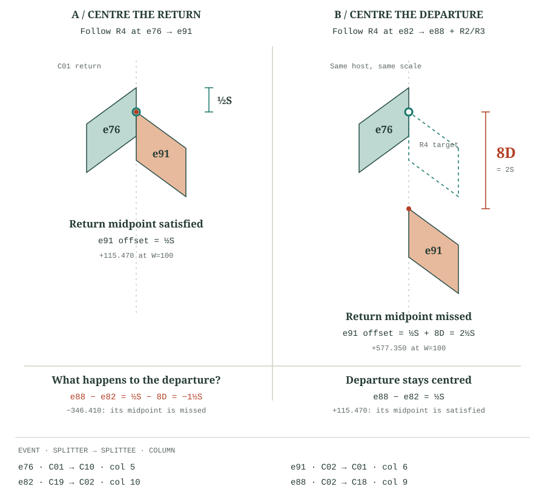

# Eyes placement investigation

**Corrected after the user's R3 clarification:** exact contact applies only to consecutive events in the same column with the same lean. An intervening opposite-lean event breaks that contact requirement. My original point 1 incorrectly imposed contact across those events and is withdrawn.

**R2 and R3 are compatible for Eyes.** The remaining findings concern competing conditional R4 requests, an R4 implementation mismatch, and R1's ascending-course geometry.

Investigated the current `wayuuFajon20Pattern` (display name **Eyes**): 43 expanded rows, 193 split events. All event numbers below are **zero-based `eventIndex` values**, not source row numbers. No application code or specification was changed.

Run the independent equation audit with:

```sh
node --experimental-strip-types scripts/investigate-eyes.mjs
```

Add `--detail` to include the expanded events and every constraint. The audit derives equalities from the HTML and checks them separately from the renderer. Its rejected-equation counts depend on insertion order; they are witnesses of inconsistency, not a minimum number of rules to remove.

**1. R2 and R3 are compatible — corrected finding.**

R3 applies when two events are consecutive in their column and have the same lean. It does not connect two same-lean events across other split events in that column.

The actual event sequence in column 9 is:

| Event | Split direction | R3 contact with the previous event in this sequence? |
|---|---|---|
| 70 | 9 → 10, right | — |
| 88 | 10 → 9, left | No: opposite lean |
| 107 | 10 → 9, left | Yes: 88 → 107 |
| 126 | 10 → 9, left | Yes: 107 → 126 |
| 145 | 10 → 9, left | Yes: 126 → 145 |
| 164 | 10 → 9, left | Yes: 145 → 164 |
| 187 | 9 → 10, right | No: opposite lean |

There are **five opposite-lean events** between e70 and e187. Therefore R3 imposes **no contact equality between e70 and e187**. The four adjacent left-lean pairs above are valid R3 contacts.

Let `S = cellSide`, `D = crossGapDrop`, and `T = S − D`. Cord continuity and the seven column-10 contacts still imply `y[187] − y[70] = 7S`. That is a permitted separation; there is no competing `S` requirement. The previously reported 6S gap is not a violation.

The corrected audit checks **142 R3 equalities, all satisfied**, alongside **111 R2 joins, all satisfied**. R2 + R3 is feasible at all 12 tested angle combinations. The 16 interrupted same-lean chains are checked separately for the implementation's non-overlap condition; none violate it. They are not R3 contact failures.

No relaxation of R3 is needed. The original finding came from my incorrect interpretation, not a conflict in the user's intended rule. The source HTML has not been edited; this audit uses the user's clarified scope.

**2. R4 midpoint anchors can conflict with one another through R2 and R3.**

Using the clarified R3 scope, all R4 midpoint requests still cannot hold simultaneously. This is a conflict between optional targets; R4's existing conditional status permits some of them to yield.

A concrete conflicting pair is:

- C02 departure, events **82 → 88**: `y[88] − y[82] = S/2`.
- C01 return, events **76 → 91**: `y[91] − y[76] = S/2`.

R2 and immediate-neighbour R3 contacts imply that these two differences differ by **8D**. The audit's witness is:

```text
76 → 67 → 49 → 31 → 13 → 32 → 14 → 33 → 52
   → 71 → 82 → 88 → 107 → 89 → 108 → 90 → 109 → 91
```

Excluding the R4 link 82→88, this path contributes eight `+S` column contacts and eight `−T` cord joins: `8S − 8T = 8D`. If the departure is centred, the return must have offset `S/2 + 8D`, not `S/2`. At the audit defaults these values are **577.350269 versus 115.470054**. Since supported θ values give `D > 0`, the two midpoint requirements cannot both be met.



The diagram holds e76 fixed. Left centres the C01 return (e76→e91); keeping R2/R3 exact then forces the C02 departure offset to `S/2 − 8D = −346.410162`. Right centres the C02 departure (e82→e88); the return is then forced to `S/2 + 8D = 577.350269`. The dashed e91 is its midpoint target. These are local consequences of the constraint chain, not complete alternative braid layouts. Vertical proportions use the report defaults; horizontal scale is expanded.

R4 therefore needs an explicit selection policy. Its exception must include **previously accepted R4 anchors and non-overlap inequalities**, in addition to R2/R3 equalities. A pair belonging to an already connected body is not itself proof of conflict: the implied offset might already match its target. Also, two cells in different bodies can conflict through inequalities. The code processes candidate transitions in event order; this is a greedy policy, not a guarantee that the most anchors are satisfied.

**3. The code can accept an R4 anchor without centring it.**

`alignContinuingSplittees` returns the R2 anchor first if the splittee continues an existing ribbon. That can bypass the splitter's departure anchor on the same event. Later, `packConnectedRibbons` imposes equal shifts (`distance: 0` both ways), assuming the earlier placement already put the cells at the midpoint.

Tracing a temporary copy of the current layout function shows:

| Departure | Offset before packing | Solver decision | Final offset | R4 target at W=100 |
|---|---:|---|---:|---:|
| 82 → 88, C02 | 0 | held | 0 | 115.470054 |
| 174 → 179, C01 | 0 | held | 0 | 115.470054 |
| 183 → 189, C10 | 0 | held | 0 | 115.470054 |

Departures 101→107 and 120→126 also start and finish at zero; they are skipped as already tied. Thus “held” is not a reliable measure of midpoint coverage.

**Suggested implementation correction:** derive the proposed shift difference from the actual geometry:

```text
shift[later] − shift[earlier]
  = S/2 − (topLaterAtSharedBoundary − topEarlierAtSharedBoundary)
```

Then test that equality against the complete accepted system. Record whether it is satisfied, accepted, or rejected and retain a conflict witness. A feasible proposal should not be replaced with equal shifts simply because the provisional placement was assumed correct. Correcting this does not eliminate the competing R4 targets in item 2.

**4. R1's ascending-course claim contradicts its own corner equations.**

The [R1 caption](finished-cell-placement.html#r1) says a negative course step preserves the identical corner contact. But the stated cell geometry always uses `end.y = start.y + D`. An ascending scaffold uses `next.start.y = start.y − D`, so `next.start.y − previous.end.y = −2D`, not zero. The asserted exit-to-entry corners cannot coincide unless D=0. At the defaults their boundary edges overlap by 2D rather than meeting at one point.

R1 is already labelled provisional; describe it as a descending scaffold whose contacts may change during alignment and packing. If an ascending action must preserve the same physical corner connection, the cell/crossing orientation needs a corresponding change. Merely negating the step does not do that. The exception in the invariants also needs to account for R3 and R4, since they can move cells belonging to different ribbon runs.

**Measured outcome and documentation drift.**

At θ=30°, tip=30°, with zero stagger:

| HTML target | Relations checked | Missed by current layout |
|---|---:|---:|
| R1 exit-to-entry contact | 150 | 14 (provisional) |
| R2 full-edge continuation | 111 | 0 |
| R3 consecutive same-lean column contact | 142 | 0 |
| Interrupted-chain non-overlap (implementation) | 16 | 0 |
| R4 midpoint | 57 | 29 (17 returns, 12 departures) |

Actual midpoint coverage is **12/29 returns and 16/28 departures** at these defaults. This is measured geometry, not solver admission counts. The equation audit also checks θ ∈ {10,30,60,75} and tip ∈ {10,30,90}: nine existing test-grid combinations plus three at the layout API's θ=75 clamp. R2+R3 and R2+R4 are each feasible throughout. Enforcing every R4 target together with R2+R3 remains infeasible throughout. R3 contact residuals and interrupted-chain non-overlap checks pass throughout.

Other statements needing correction:

- The opening table says later rules win, but R4 explicitly yields, and the final packing preserves R2 joins. State the precedence directly: R2 and the selected hard R3 conditions are mandatory; R4 is conditional; R1 is provisional.
- The solver outline says “a minimum separation for the rest,” which could include opposite leans and contradict R3's prohibition. Limit that phrase to interrupted same-lean chains.
- Equal ribbon/action slope occurs at `tipAngle = 90° − θ`; packed rhombus geometry occurs at `tipAngle = 2θ`. These coincide only at θ=30°, not at every packed angle.
- The HTML's “all six samples” and mirrored-diamonds coverage are stale: the current sample list contains five entries.
- `npm test` currently reports **14 passing, 3 failing**. Two failures are Eyes fixtures referencing obsolete event relationships: events 62 and 85 now occupy different columns (14 and 13), and event 82 is splittee C02, not C03. The third is a double-chevron colour/cord fixture (`C06` versus expected `C13`). These fixture failures do not establish an R3 conflict. The corrected audit verifies the intended R3 equalities.

Recommended order: retain the clarified R3 scope, make R4's conditional/greedy policy explicit, correct the midpoint equation in code, and then update the remaining HTML claims and event-based regression fixtures.

<!-- event-reference:start -->
**Event reference.**

All event IDs are zero-based; columns are one-based. Details are generated from the simulated Eyes pattern.

| Event | Splitter | Splittee | Column |
|---|---|---|---:|
| e13 | C05 | C10 | 9 |
| e14 | C05 | C16 | 10 |
| e31 | C04 | C10 | 8 |
| e32 | C04 | C16 | 9 |
| e33 | C04 | C17 | 10 |
| e49 | C03 | C10 | 7 |
| e52 | C03 | C18 | 10 |
| e62 | C19 | C11 | 14 |
| e67 | C02 | C10 | 6 |
| e70 | C02 | C18 | 9 |
| e71 | C02 | C19 | 10 |
| e76 | C01 | C10 | 5 |
| e82 | C19 | C02 | 10 |
| e85 | C19 | C05 | 13 |
| e88 | C02 | C18 | 9 |
| e89 | C02 | C17 | 8 |
| e90 | C02 | C16 | 7 |
| e91 | C02 | C01 | 6 |
| e101 | C18 | C03 | 10 |
| e107 | C03 | C17 | 9 |
| e108 | C03 | C16 | 8 |
| e109 | C03 | C01 | 7 |
| e120 | C17 | C04 | 10 |
| e126 | C04 | C16 | 9 |
| e145 | C05 | C01 | 9 |
| e164 | C20 | C09 | 9 |
| e174 | C11 | C01 | 15 |
| e179 | C01 | C15 | 14 |
| e183 | C20 | C10 | 5 |
| e187 | C20 | C12 | 9 |
| e189 | C10 | C05 | 4 |
