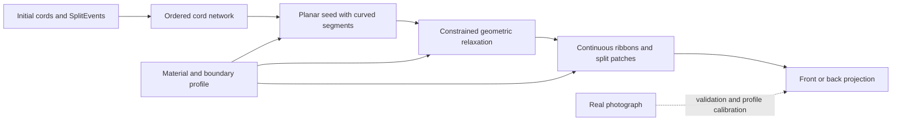

# Proposed generator: continuous cords with local split geometry

## Intended output

Generate a plausible, flat finished braid from the complete cord setup and split history. In the first version, every cord has one colour, the braid has no additions/removals or sewn joins, and the output is an SVG with continuous curved cords and local split patches. Every visible patch remains traceable to a cord and, where applicable, an event.

This is a geometric approximation to test against the photograph. Exact dimensions and material behaviour are not uniquely determined by `SplitEvent[]`. The API must expose a small material/boundary profile and report assumed values, rather than hide them in event-placement exceptions.



The photograph is a validation target and a way to calibrate shared parameters. It is not a runtime texture, a source of per-event positions, or a template the generator traces to fabricate eyes.

## 1. Input and output contracts

Proposed interfaces, not changes to the current app:

```ts
type FinishedInput = {
  cords: Cord[];                 // all initial cords, including untouched ones
  events: SplitEvent[];          // ordered, validated, expanded exactly once
  profile: {
    diameterByCord: Record<string, number>;
    crossingAngle: number;      // preferred acute angle between cord tangents
    pitchSS: number;            // splitter -> splitter interval, in diameters
    pitchTT: number;            // splittee -> splittee interval
    pitchMixed: number;         // role change; provisional shared value
    bendRadius: number;
    openingSize: number;
    partition: 'equal-bundles'; // explicit assumed model, not recovered input
  };
  boundary: {
    kind: 'flat-free-strip';
    widthInDiameters: number;
    start: 'free-frontier' | 'straight-anchor';
    end: 'unfinished-frontier';
  };
};

type FinishedResult = {
  topology: CordNetwork;
  geometry: CordGeometry;
  surface: SurfaceGeometry;
  assumptions: string[];
  diagnostics: GeometryDiagnostic[];
  quality: {
    forbiddenIntersections: number;
    invertedScaffoldTriangles: number;
    maxStretchResidual: number;
    maxPenetration: number;
    converged: boolean;
  };
};
```

The pitch parameters are fitting parameters, not yet measured material constants. Begin with a common pitch and add a role-dependent value only if the physical comparison requires it. Colours affect surface rendering, never the topology, boundary inference, or geometric objective.

No source-row IDs, eye-centre coordinates, handwritten cell placements, or references to `finishedLayout*` enter this API. Units are normalised by cord diameter until a physical scale is known.

## 2. Construct the complete cord network

For each cord, collect **all** events involving it, ordered by construction history, regardless of role. Join consecutive visits with a uniquely identified segment. Add a start and end terminal. Unused cords have a direct start–end segment and are separately reported as unintegrated material.

```text
last[cord] = startTerminal(cord)
for each event in construction order:
    validate adjacent exchange and snapshot continuity
    create junction(event)
    for cord in [event.splitterId, event.splitteeId]:
        connect(last[cord], junction(event), cord)
        last[cord] = junction(event)
for each initial cord:
    connect(last[cord], endTerminal(cord), cord)
```

At a junction let `a` be the cord on the left before the exchange and `b` the one on the right. Record the cyclic port order:

```text
a-in, b-in, a-out, b-out
```

Preserve the through-pairings `a-in ↔ a-out` and `b-in ↔ b-out`. These record local topology. They are not instructions to keep the ports pointing northwest/northeast/southeast/southwest in the finished object.

The existing lane positions are sufficient to derive that arrangement under the simulator's current fixed-frame convention. If future input uses coordinates relative to a turning workpiece, normalise the whole event and its snapshot into one material frame before constructing the network. Do not infer a second mirror transform from `face` during rendering.

Keep parallel segments: two cords may meet at one event and meet again at the next visit along both cords. They have distinct paths even though the junction endpoints are identical. The audited Eyes graph contains two such pairs.

Compute the face walks from the port order. This gives regular regions, transition regions, and the outer boundary. These are stronger structural constraints than lane-gap columns. Two events may have the same gap at different times without being immediate physical neighbours; a gap number is an initialisation hint, not a permanent finished X coordinate.

Network construction is linear in the number of event incidences, apart from input validation against the existing full snapshots. The audit implements this stage and validates the current Eyes instance.

## 3. Create a valid geometric seed

Do not begin with random force-directed nodes. Start with the planar wiring implied by the adjacent exchanges; it supplies a known embedding and prevents the solver from inventing a different network.

There are two separate notions of order:

- Construction order determines the sequence of visits along a cord.
- Finished axial height is a geometric variable. It is not the event index or instruction row number.

The solver must be allowed to rotate oblique runs and form turns. It must preserve order **along each curve**, not require every curve to increase monotonically in finished Y. The audit alone does not establish which specific segments of the photographed braid turn back in Y.

Recommended seed procedure:

1. Expand every physical segment with at least one distinct intermediate control vertex. This keeps the two sides of each digon distinct and allows curvature. Additional vertices can be inserted adaptively.
2. Add a temporary outer frame. Attach start terminals along its upper arc in initial lane order and end terminals along its lower arc in final lane order. Add virtual rail edges and side frame edges outside the physical cord network, respecting the exterior face walk.
3. Enumerate the augmented faces. Reject repeated boundary vertices or degenerate polygons that the mesher cannot handle; do not silently triangulate them incorrectly. Resolve them with additional scaffold vertices or use the canonical wiring seed as the fallback.
4. Triangulate each augmented region with virtual mesh edges. Face-centre vertices are a simple implementation for suitable simple faces. Virtual edges are solver scaffolding, never cords or split events.
5. Solve a positive-weight harmonic embedding with the outer frame fixed on a strictly convex outline. Use it only as an initialisation. Check every triangle and every physical edge for degeneracy/intersection; this proposal does not assume an unchecked embedding theorem guarantees all augmented inputs. See [harmonic-model.md](harmonic-model.md) for the spring/electrical-network derivation of this step and exactly what its planarity guarantee does and does not cover.
6. Gradually move the frame toward the selected elongated strip proportions and relax the physical curves. Maintain triangle orientation and prevent forbidden intersections throughout the movement.

The long start/end fan required by an instructional wiring diagram is artificial. For a free-frontier rendering, taper the frame forces down after initialisation, retaining ordering and width constraints, so the first and last physical junctions can form an uneven working frontier. For a straight anchored start, keep the actual start terminals on the requested anchor line.

The boundary width is a declared profile parameter. Permit the left/right physical edges to move around it; fixing every exterior junction at the same X would erase real edge turns. For a sufficiently long simulation, crop an interior section to compare to the photograph. Do not pretend the photograph shows the entire start and end.

## 4. Fit packed cord geometry globally

Use junction positions, junction orientations, and segment control points as variables. Model segments initially as polylines with rounded transitions; convert to cubic curves only when that conversion passes the same topology and clearance checks. A Bézier smoothing pass can introduce crossings even when its control polygon was valid.

Each event is a finite **junction neighbourhood**, not a dimensionless drawing-order command. Its four ports move with the local tangents. The geometry determines how much cord is exposed before entering the next neighbourhood.

A candidate dimensionless objective is:

```text
E = wPitch * Σ_segments ((arcLength(segment) - targetLength(segment))/d)^2
  + wBend  * Σ_cords ∫ (d * curvature)^2 ds/d
  + wAngle * Σ_events (cos²(tangentAngle) - cos²(preferredAngle))²
  + wGap   * Σ_interiorRegions (uncoveredArea(region)/d²)²
  + wWidth * mean((localWidth - targetWidth)/d)²
  + wFrame * temporaryBoundaryPenalty
```

Here `d` is a reference diameter. For unequal cords, clearance uses both local diameters. Target segment lengths depend on its two endpoint roles and the profile pitch, with terminal spans treated separately. These are **soft** length preferences: actual consumed lengths are unknown. A port-to-port length is used consistently, with junction traversal handled inside the junction; do not count both that traversal and a centre-to-centre pitch.

The bending term is evaluated along each cord through junctions as well as between them. Regions without four sides receive no forced rhombus shape. The uncovered-area term only encourages density in interior fabric; terminal fans and deliberately free boundaries are excluded. It is paired with clearance constraints, not a licence to collapse all faces to zero area. The oblique regular mesh should emerge where the network permits it, with flexible geometry at transition faces.

Hard constraints / acceptance checks:

- Every cord retains its event sequence and its port pairing.
- Every event retains its four-port cyclic order in projection.
- Two unrelated physical segments cannot cross or penetrate. The only allowed centreline crossing is the specified pair inside its own junction neighbourhood.
- Physical thickness is enforced outside junction neighbourhoods. Inside them, use the split template's explicit front/back bundle separation.
- Triangulated scaffold elements cannot invert or collapse during a solver step. This supports topology preservation but does not replace finite-width collision checks.
- Starts and ends retain their ordering. Free edges remain simple, with no unexplained branches or new contacts.
- Junctions and physical segments have minimum nonzero dimensions; translation/rotation are fixed and scale is set by diameter and the width profile.

Use a constrained optimiser or small-step projected relaxation with backtracking. If a proposed step violates a hard condition, shorten or reject the step. Accelerate collision candidates with a spatial index. Start on a coarse mesh and refine only curves/contacts with high residuals.

Do not fix impossible geometric equalities by breaking cord continuity or moving one event by hand. Return an unresolved layout with the offending segment IDs, residuals, and a diagnostic view. If the relaxed solution consistently fails at the same transition across material settings, revisit the input convention or the junction model.

This objective and solver have **not been implemented or photo-validated here**. The major engineering risk is finding stable dense embeddings without locking in the seed's artificial start/end shape. Multi-start experiments and boundary sensitivity checks in the validation plan are necessary before claiming prediction.

## 5. Render the split, then the cord texture

At a ply split, the splitter passes through the splittee. A useful first surface model divides the splittee into two same-coloured bundles locally: one on the front side of the splitter and one on the back. Their paths reunite into the same cord outside the junction. This is an explicitly assumed equal-partition model.

Use local depth layers:

```text
front camera
    front splittee bundle
    splitter passing through the aperture
    back splittee bundle
back camera
```

This explains why the splittee contributes the surface colour at the junction without making the entire cord globally “over” its neighbours. Draw the splitter continuously, mask only the locally hidden portion, and retain visible splitter spans between openings. The exact patch size and bundle separation come from geometry/profile parameters, not from a fixed diamond icon.

Renderer stages:

1. Tessellate the full cord centrelines into ribbons/tubes with stable cord IDs.
2. Replace the neighbourhood of each split with the bundle/aperture geometry.
3. Project visible fragments for the requested face using local depth, or use an actual depth buffer. Fragment splitting resolves cyclic occlusion; sorting whole cords cannot.
4. Add restrained shading to expose roundness and the openings.
5. Add ply texture along arc length, maintaining phase along a cord when phase is supplied. With unknown twist, use an explicitly decorative default and keep it out of structural validation.

For a reverse view, project the same object from the other side and mirror the screen orientation consistently. Do not remove alternate rows or swap splitter/splittee roles. With a homogeneous equal-partition splittee, both exposed bundles have the same colour; more detailed reverse-face asymmetry is unverified without actual ply/rotation data.

Begin with flat colours and clear junctions. If the nested eye bands do not appear correctly, extra highlights or texture cannot count as progress on the structural match.

## 6. Where Eyes should come from

The source supplies two repeated ten-cord colour groups. Successive active runs move across different parts of that setup; the all-A events 76, 77, and 172 exchange same-colour cord identities; later runs reverse working direction. The graph retains these changes, including its non-quadrilateral transition regions and recurring cord pairs.

The **hypothesis** is that fitting this network as a dense strip, then showing its local splittee surfaces and connecting cord spans, produces nested bands with the photo's alternating lateral placement. The audit establishes the network and transitions, not that hypothesis's visual success. A useful failure would be a sound network embedding that consistently gives a different motif: it would point to an incorrect source correspondence, orientation convention, junction visibility model, or packing model.

No eye detector, diamond stamp, or special case for a particular source row is needed in generation. Detect eye centres only in evaluation, after the image has been generated.

## 7. Long previews and repeat seams

Always simulate the requested history before building the network. Do not duplicate the 173-event picture vertically: the final cord identities and working face differ from the beginning after one written block.

For an interior photo comparison, generate several consecutive blocks and crop only after geometry stabilises away from the ends. Test whether the crop changes when another block is added. For large inputs, solve an overlapping window and retain several neighbouring interactions along **each cord** at its boundary, not merely a fixed number of instruction rows.

A periodic solve must identify matching states, pair every outgoing boundary cord with the correct incoming identity, and preserve geometry/tangent conditions across the seam. The measured ten-block identity/working-face return is a possible combinatorial seam. It is not proof of twist-phase or material-period closure. Until that richer state exists, describe the view as a finite-strip approximation.
